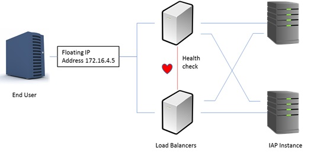

# Load Balancer
A load balancer improves the distribution of workloads across multiple computer resources. Load balancing aims sits between the end users and the servers. Not only does the load balancer distribute the requests between all the backend servers, but also checks its health to avoid any request is sent to a not available backend. 

To provide complete high availability in the system, the load balancer function needs also redundancy: two load balancers running in active/passive cluster configuration in which each load balancer monitors the other and share a Virtual IP. The active node will be handing the VIP and receiving all the IP requests. In the event that the active node fails, the other node is promoted to active and assigned the VIP without service affectation.

Our load balance solution is composed by following components:
 - HA-Proxy. Is a load balancer software. It listen for incoming connections in the VIP and forwards to the server pool. HA-Proxy continuously monitors the server nodes to avoid forwarding requests to not accessible servers.
 - Keepalive: this is a simple cluster software. It decides which node should be the master and assigns the VIP to it. In case that the active node fails, keepalive will promote the passive node to active state and will assign the VIP. For a node to be promoted as active, both Keepalived and HA-Proxy needs to be working on the node. To avoid brain split situations (both nodes think they are the active node) the cluster interface must be same network interface where the service is provided (and the VIP assigned). If the two nodes don’t have connectivity between them, then any other element in the network will necessarily only be able to connect to one of the nodes.

## HAProxy

configured
 - /etc/haproxy/haproxy.cfg
 - /etc/firewalld/services/haproxy-http.xml
 - /etc/firewalld/services/haproxy-https.xml

## Keepalive

configured
 - /etc/keepalived.conf 

## Notify keepalived
 - Install notify-keepalived.sh into /var/iap/bin
 - Allow permisions /etc/crontab

## Ansible

Install with [ansible](ansible)

